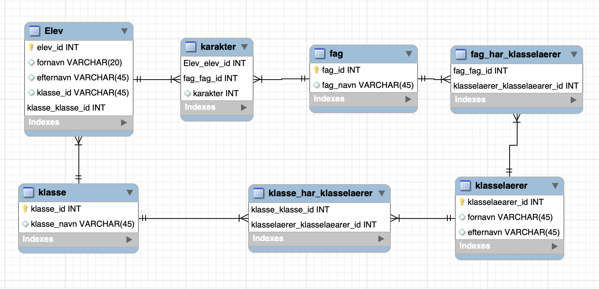
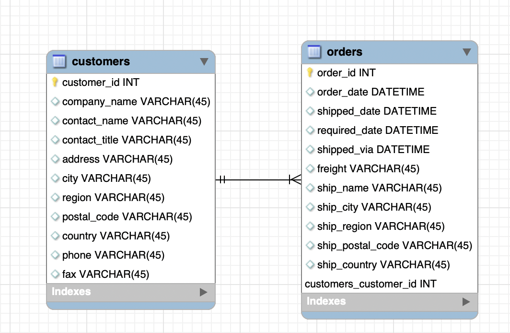
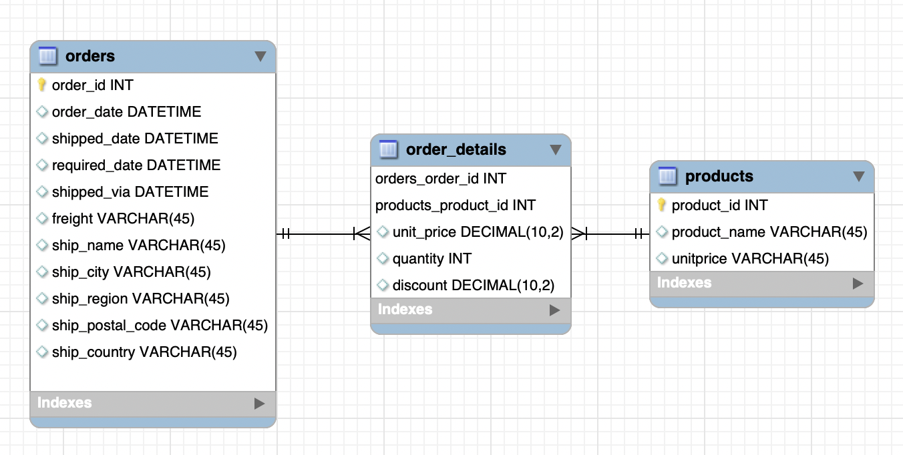
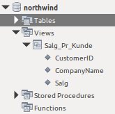

# Kursusgang 3 Normalisering og Table Joins
1. Normalisering
  - Første, anden og tredje normalform.
2. Relationer mellem tabeller: OneToMany, OneToOne, ManyToMany.
3. Join af tabeller.
  - INNER JOIN
  - LEFT/RIGHT JOIN
  - OUTER JOIN
4. Views
5. Import / Export.

### SQL fil
[Link til SQL fil](/sql_filer/Dag_3.sql)

[Postnummer CSV](/sql_filer/postnumer.csv)

[Link til SQL Demo Ansatte](/sql_filer/Dag_3_Ansatte.sql)

## Normalisering
Formålet med normalisering er at undgå redundans og gøre databasen lettere at vedligeholde.

*Redundans er er gentagelser - Når en information står flere gange*

Der findes 6 normalformer, men typisk fortager man kun en normalisering op til den tredje normalform.

### Huskeregel
*The key, the whole key, and nothing but the key, so help me Codd.* 

**1. Normalform (NF1)**

**Definition:** *En relation er på første normalform, hvis ingen af dens domæner har elementer, der i sig selv er mængder.*

* Tabellen har et nøglefelt. 
* Der må kun være en værdi af samme type i hver post
* Alle poster skal være lige lange dvs. have samme antal felter


**2. Normalform (NF2)**

**Definition:** *En relation er på anden normalform, hvis den er på første normalform, og hvis enhver ikke-nøgle-attribut er fuldt funktionelt afhængig af enhver kandidatnøgle i relationen.*

* Tabellen skal opfylder 1. Normalform
* Der skal være en primærnøgle
* Ingen felter må være afhængige af en del af primærnøglen.

**3. normalform (NF3)**

**Definition:** *En relation er på tredje normalform, hvis den er på anden normalform og det gælder, at ingen ikke-nøgle-attribut er transitivt afhængig af nogen kandidatnøgle i relationen.*

* Tabellen skal opfylder 2. Normalform
* Hvis der er mere end et felt der kan sættes som nøgle for andre felter, skal tabellen opdeles i flere tabeller.

{pagebreak}

### Eksempel - Skole
Udgangspunktet er et regneark der bruges til at registere elever og deres karakterer.

**NF 0**


*Hvad er problemet?*

**NF 1**


**NF 2**


**NF 3**


**ER-Diagram**

Over Skole i normalform 3. Med angivelse af datatyper og relationer melle de 5 tabeller.



Du kan bruge Workbench til at tegne dit ER-diagram. Jeg vil dog altid anbefale at du starter med tegne ER-Diagrammet på et stykke papir.

**SQL kode**
Du kan hente SQL koden [her](sql/Skole.sql) 

## Relationer
MySQL er en relationel database, hvilket betyder at data er opdelt i tabeller, som det er muligt at oprette relationer i mellem.

Hver tabel har en primærnøgle, som består af et eller flere felter i tabellen. Primærnøglen skaber en unik identifikation af den enkelte række i tabellen. 

En fremmednøgle er et felt i en tabel, som peger på en primærnøgle i en anden tabel og dermed skaber relation mellem de to tabeller. 

Der findes tre typer af relationer:

* En til Mange
* En til En
* Mange til Mange


**En til Mange**

Det er denne relationstype der typisk er flest af i en database. 

I Northwind databasen har vi en typisk **En til Mange** relation mellem tabellerne **Customers** og **Orders**.

Hver kunde står kun en gang i **Customeres** tabellen, men da hver kunde har en eller flere ordre står kunden flere gange i tabellen **Orders**.

Det vil sige at relationen går fra primær nøglen **CustomerID** (*En siden*) i tabellen **Customers** til fremmednøglen i, CustomerID i tabellen **Orders** (*Mange siden*).




**En til En**

Denne relationstype bruges kun af to grunde:

* Sikkerhed
* Opdeling af en meget stor tabel

Årsagen er at man ligeså godt kunne have alle data i en tabel.

**Eksempel**


Et eksempel kunne være fortrolige oplysninger som:

* Cpr nummer
* Løn
* Pension

Der er gemt i en selvstændig tabel som så er relateret til en tabel med det mere "almindelige" oplysninger som navn, mobilnummer, e-mail osv.

**Mange til Mange**

Det er **ikke** muligt at oprette en Mange til Mange relationer i MySQL databasen.

En Mange til Mange relation skal løses ved at indskyde en ekstra tabel mellem de to tabeller hvor relation er. 

I Northwind databasen er der mange ordre og der er mange produkter - hver ordre består af et eller flere produkter.

Der er altså en **Mange til Mange** relation mellem tabellerne **Orders** og **Products**.

Dette løses var at oprette en ekstra tabel - Order_details - Da denne relationen mellem de to tabeller **ikke** kan oprettes direkte.




## JOIN
Du skal bruge SQL kommandoen **JOIN** for hente data fra flere tabeller.

Der findes 4 forskellige **JOIN** typer:

* INNER JOIN  
* LEFT JOIN  
* RIGHT JOIN
* FULL JOIN (ikke understøttet i MySQL)
* SELF JOIN

### INNER JOIN

Henter fællesmængden fra de to tabeller - Altså der hvor værdierne er ens.


### LEFT JOIN
Henter alle data fra den venstre tabel (*table1*) og de data der matcher fra den anden tabel (*tabel2*).


Kaldes også **LEFT OUTER JOIN**

### RIGHT JOIN
Henter alle data fra den højre tabel (*table2*) og de data der matcher fra den anden tabel (*tabel1*).


Kaldes også **RIGHT OUTER JOIN**


### FULL JOIN
Der findes også en **FULL JOIN**, der henter alle data fra begge tabeller.

**Bemærk** at MySQL **IKKE** understøtter **FULL JOIN** 


[Link til hvordan en full join kan løses med MySQL](https://stackoverflow.com/questions/30092068/sql-full-outer-join-not-working "https://stackoverflow.com/questions/30092068/sql-full-outer-join-not-working")


### SELF JOIN
En **SELF JOIN** joiner en tabel med sig selv.
Tabellen **Employees** i Northwind databasen har et eksempel på dette.

Der er ef felt **ReportsTo** der referer til primærnøglen **EmployeeID** i sammen tabel.


## VIEW
Et **VIEW** kan betragtes som en virtuel tabel. 
Et **VIEW** har kolonner og poster som en tabel, men den bliver oprettet via en SQL sætning på basis af en eller flere andre tabeller.

Et **VIEW** kan erstatte en kompliceret SQL sætning.
Det er altså nemmere for brugeren at hente data fra et **VIEW**.

Et **VIEW** vil altid vise de nyeste data.

```
	CREATE VIEW view_navn AS
	SELECT kolonne_1, kolonne_2, ....
	FROM tabel
	WHERE betingelse;

-- Eksempel fra Northwind
	
	create view Salg_Pr_Kunde AS
	select 
		Customers.CustomerID,
    		Customers.CompanyName,
    		sum(Order_Details.UnitPrice * Order_Details.Quantity) as Salg
	from Customers
	join Orders
	on Customers.CustomerID = Orders.CustomerID
	join Order_Details
	on Orders.OrderID = Order_Details.OrderID
	group by Customers.CustomerID, Customers.CompanyName;
```

Du finder **VIEW** i en selvstændig mappe i din database



Du finder **VIEW** i en selvstændig mappe i Worksbench.


## Data Import
I mange tilfælde har du data fra et andet system og vil gerne have disse data ind i MySQL Databasen.

Det er muligt at importere flere forskellige formater, men det nemmeste er CSV formatet (**C**omma **S**eparated **V**alues).

**Import GUI**
MySQL har en "funktion" der guider dig igennem importen.
Denne finder du nemmest ved at højre klikke på den database du skal importere data ind i.

1. Vælg - *Table Data Import Wizard*
2. Vælg den CSV fil der skal importeres
3. Du har nu mulighed for:
	1. Import til en eksisterende tabel 
	2. Import til en ny tabel
4. Vælg hvilke felter der skal importes til hvilke felter
5. Data importeres

**Import SQL Kommando**
Det er også muligt at foretage importen via en SQL kommando.

```
LOAD DATA INFILE '/var/lib/mysql-files/postnumer.csv' 
INTO TABLE  PostNrBy
FIELDS TERMINATED BY ',' 
-- ENCLOSED BY '"'
LINES TERMINATED BY '\n'
IGNORE 1 LINES;

```
Fordelen ved at bruge denne metode er at det er meget nemt og hurtigt at foretage importen igen, hvis det skulle være nøvendigt.

**Klargøring af Data**
Det er typisk en fordel at dine data er klargjort til import inden du starter importen.
Det kan være du skal fjerne ekstra rækker eller ændre på datoformatet.


## Opgave 3
Du kan hente opgave 3 her som PDF - [Opgave 3](Opgave_3.pdf)


## Til næste gang 

- Overvejelser med hensyn til normalformer
- ER-diagram med angivelse af alle nøgler og datatyper
- løsning til opgave 3


